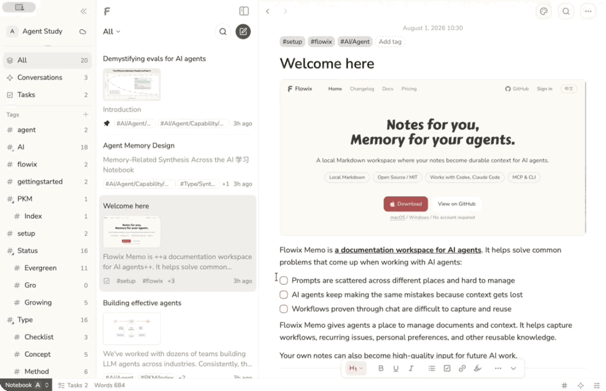
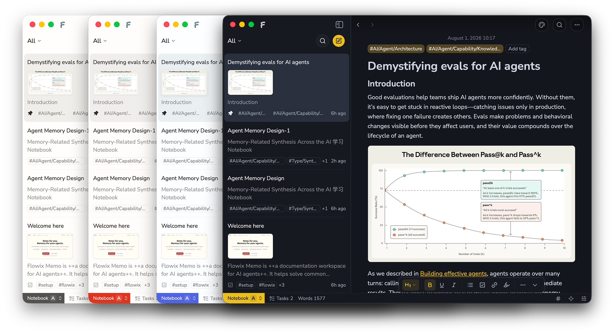
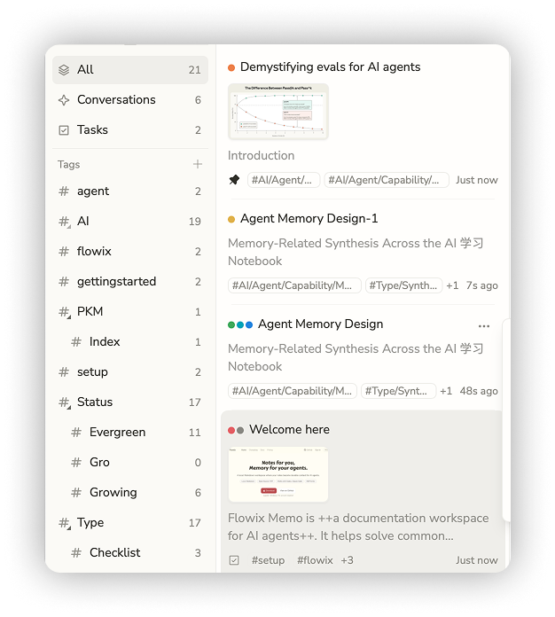
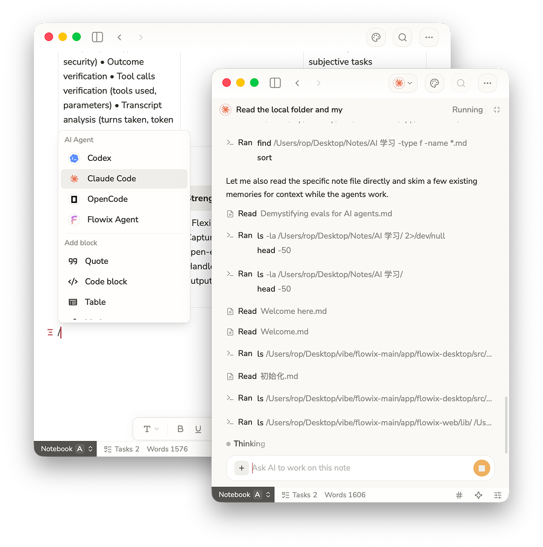
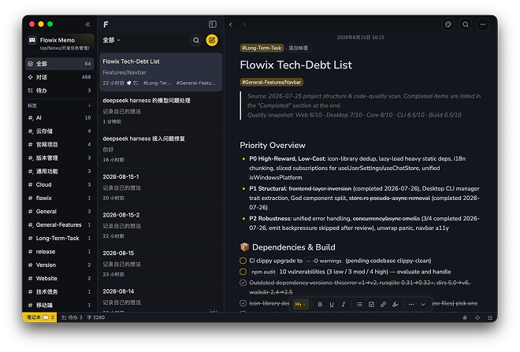
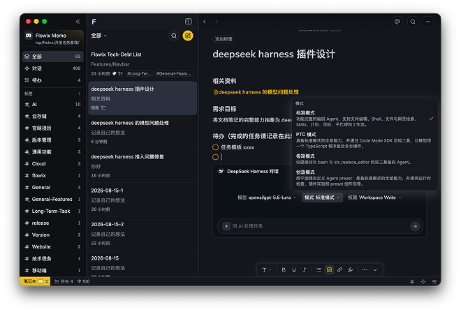
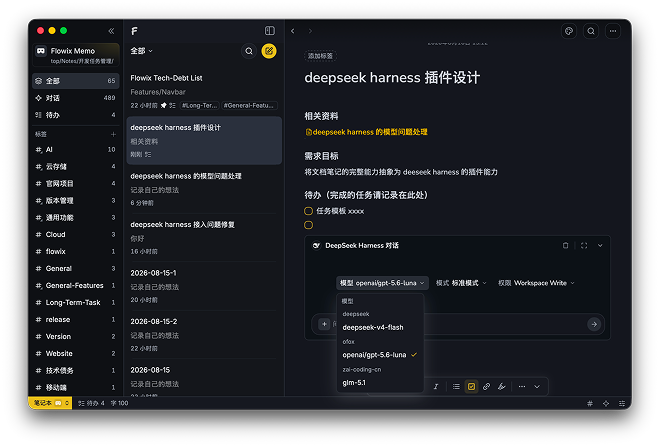
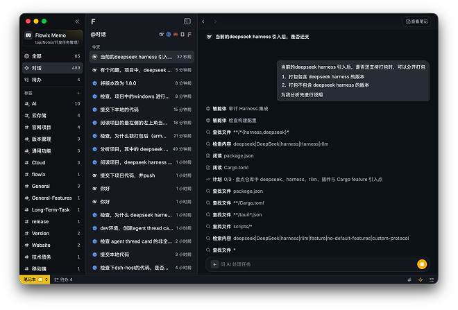
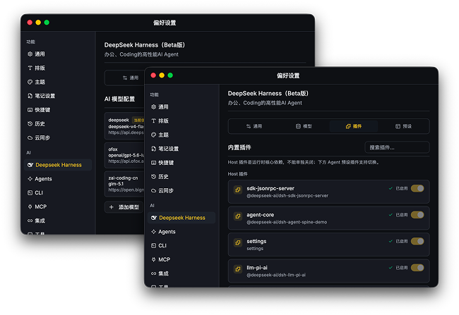
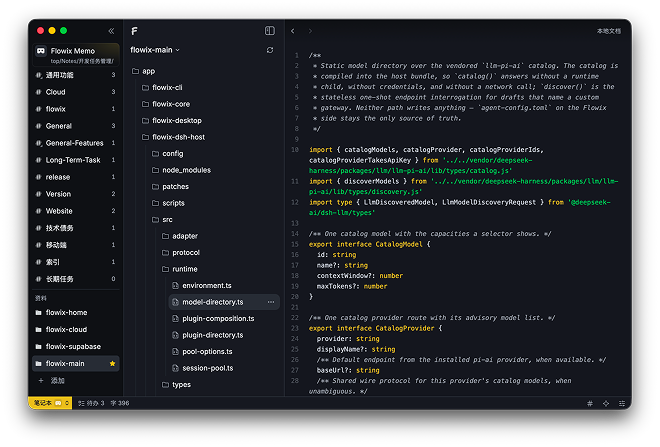

<p align="right">
  <a href="./README.md">English</a> | <a href="./README.zh-CN.md"><b>简体中文</b></a>
</p>

<p align="center">
  
</p>

<h1 align="center">你的笔记，<br />AI 的记忆。</h1>

<p align="center"><strong>本地 Markdown 笔记本，让你的写作无缝成为 Agent 可以持续使用的上下文。</strong></p>

<p align="center">
  Markdown · 开源 · 多 Agent · MCP 与 CLI
</p>

<p align="center">
  <a href="https://flowix-memo.com/"><b>立即下载</b></a> ·
  <a href="https://flowix-memo.com/"><b>官网</b></a> ·
  <a href="https://flowix-memo.com/docs/"><b>文档</b></a>
</p>

---



## Flowix 让笔记成为持续工作的记忆

用 Markdown 记录内容，把需要的上下文交给 Agent，再将结果写回同一篇笔记，方便检查、修改和下次继续使用。



---

## 让工作持续推进

把产品、开发、研究和个人知识放在一起，让 Agent 不必每次从头开始。

| 场景 | 说明 |
| --- | --- |
| **产品工作** | 集中管理需求、反馈和决策，让产品文档保持最新。 |
| **软件开发** | 保存项目背景和约束，让编码 Agent 接着推进。 |
| **课题研究** | 将资料、分析和结论放在一起，方便追溯和复用。 |
| **个人知识** | 让笔记、计划和个人偏好成为 Agent 可用的上下文。 |

<p align="center"></p>

---

## 让不同 Agent 使用同一份记忆

你可以在 Flowix 内使用 Agent，也可以连接 **Codex**、**Claude Code**、**OpenCode**、**Hermes** 及其他 MCP 或 CLI 工具，让它们基于同一套笔记和上下文工作。

<p align="center"></p>

---

## dsh-flowix-memory 插件

[dsh-flowix-memory](dsh-flowix-memory/README.md) 是一个 [DeepSeek Harness](https://github.com/deepseek-ai/deepseek-harness) 插件，通过捆绑的 `flowix-cli` MCP server 把任何 Harness Agent 连接到你的**本地 Flowix 笔记**：安装后 Agent 获得 `mcp__dsh-flowix-memory__flowix_memo` 工具，可搜索、读取、创建和编辑 Flowix 笔记（包括思维导图）。

从 flowix-main checkout 安装到 `flowix` Harness profile（尚未发布到 npm）。对于其他 DSH 客户端，`flowix` 只是一个普通的自定义 profile 名称：

```sh
dsh plugin --profile flowix add ./dsh-flowix-memory
```

需要 `flowix` CLI 位于 `PATH`（或设置 `FLOWIX_CLI_PATH`），并可访问你的笔记数据（`~/.flowix`）。详见[插件 README](dsh-flowix-memory/README.md)。

---

## 笔记留在本地，由你掌控

Flowix 将笔记保存为本地 Markdown 文件。你决定 Agent 能看到什么，也可以自由选择同步和备份方式。

- **保存在本地** — 笔记是普通 Markdown 文件，可以用其他应用打开和编辑。
- **按需连接 Agent** — 使用 Codex、Claude Code、OpenCode 等 Agent 时，只提供你主动选择的内容。
- **自由同步和备份** — 继续使用你熟悉的同步、备份或版本管理工具。

---

## 产品预览

| | |
| --- | --- |
| <br/>*笔记列表与标签组织* | <br/>*笔记详情与 Agent 预设* |
| <br/>*Agent 模型选择* | <br/>*全文与文件搜索* |
| <br/>*Provider 与 MCP 配置* | <br/>*代码文件浏览与编辑* |

---

## 快速开始

1. 从 [官网](https://flowix-memo.com/) 下载并安装 Flowix。
2. 新建一个本地文件夹，或将已有文件夹注册为笔记本。
3. 创建一篇文档，记录任务背景、参考资料、目标与约束。
4. 在文档内调用 Agent，或继续用标签与属性组织内容。

## 本地开发

```bash
git clone https://github.com/text2future/flowix.git
cd flowix
npm install

npm run tauri dev
npm run dev
npm run tauri build
```

开发环境要求 Node.js 20+、Rust 1.75+ 与 Tauri v2；桌面应用支持 macOS 14+ 与 Windows 10+。

## 许可协议

Flowix 基于 MIT 协议开源。
